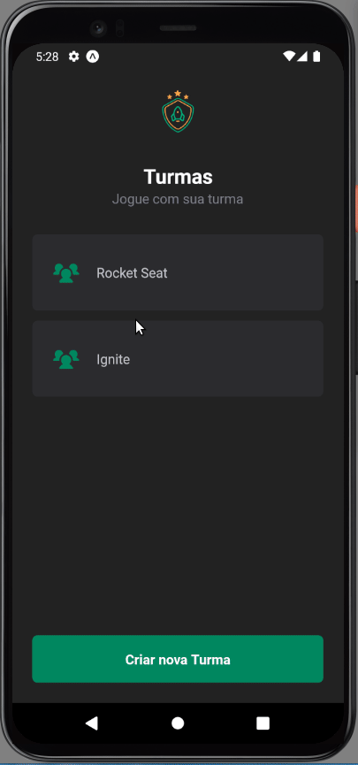

<h1 align="center">
    <p>Ignite Teams<p>
</h1>

## Images and gifs




## About 
 
**Ignite Teams** is a project designed during rocketseat classes, putting in practices some tools to make the project more reliable and consistent.

Basically you can register groups of people and inside of each group, you have option to have teams and inside team, you can register people

## Tools and Features

- [React](https://reactjs.org/)
- [React Native](https://reactnative.dev/)
- [TypeScript](https://www.typescriptlang.org/)
- [Hooks](https://legacy.reactjs.org/docs/hooks-state.html)
- [Babel](https://babeljs.io/docs/)
- [Styled-components](https://styled-components.com/docs)
- [React-Navigation](https://reactnavigation.org/docs/getting-started)
- [AsyncStorage](https://docs.expo.dev/versions/latest/sdk/async-storage/)


## If you wanna try

```bash
    # Clone Repository
    $ git clone https://github.com/Renatoogata/React-Native-Aula02-IgniteTeams.git
``` 

```bash
    # Install the dependencies
    $ npm install
```

```bash
    # Im runing with expo, just enter in your project dir and run
    $ expot start
```

## Updates
